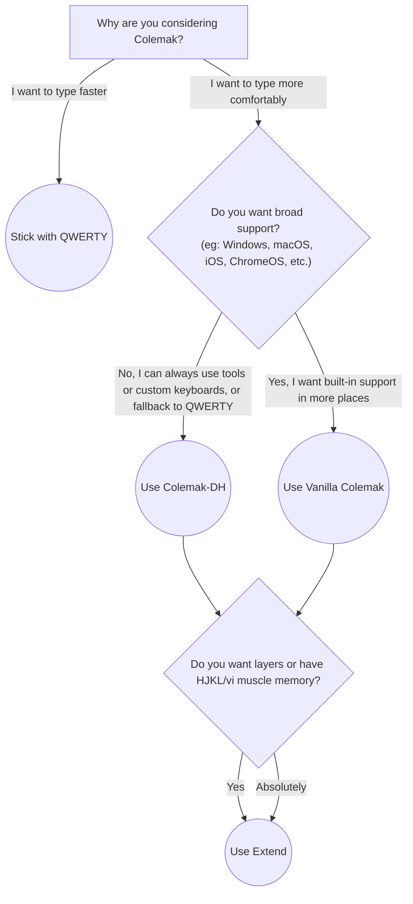

# Advice

### Most of the advice I give about Colemak boils down to a handful of things:

- Dvorak, although it's not the most modern layout, is still a _**BIG**_ improvement over QWERTY.
- Colemak is a niche within a niche, but it is the best choice if you're looking to change your layout. It's a _**minor**_ improvement over Dvorak.
- Everything else is a niche within a niche within a niche. Other layouts are at best a _**miniscule**_ improvement over Colemak, and are only worth it if you have a very specific to your particular typing needs.
- Switching your keyboard layout is a massive commitment. Be sure you're doing it for the right reasons.

### The advice I give about vanilla Colemak vs Colemak-DH can be boiled down to this decision tree:

